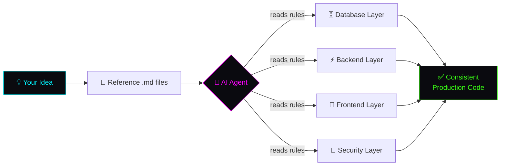

<div align="center">

<!-- ANIMATED TYPING HEADER -->
<a href="https://github.com/Udhayaboopathi">
  
</a>

<br/>

<!-- SUBTITLE -->
### 🧠 A strict instruction library that forces any AI agent to build production-grade code — your way, every time.

<br/>

<!-- BADGES -->


<!-- TECH SHIELDS -->
<p>


</p>


</div>

## 🎯 The Problem

You ask your AI agent to *"build a user feature"*…

- 🤡 It invents its own folder structure
- 🌀 Next feature = completely different pattern
- 🔓 Security becomes an afterthought
- 🍝 Your codebase turns into spaghetti

**AI agents have no memory of *your* architecture. So every response drifts.**

<div align="center">

</div>

## ✨ The Solution

**11 battle-tested `.md` instruction files** that act as a strict rulebook for any AI coding agent (Cursor · GitHub Copilot · Claude · Windsurf).

Drop the files into your project, reference them in your prompt, and the AI builds **consistent, secure, enterprise-grade code — every single time.**

```txt
"Read database.md, backend.md, frontend.md, security.md
 and STRICTLY follow every instruction in them."
```

That's it. No drift. Same structure for every feature. 🔥

<div align="center">

</div>

## 📦 What's Inside

<table>
<tr>
<td width="50%" valign="top">

### ⚡ Backends (4)
| Stack | Language |
|-------|----------|
| 🐍 FastAPI + SQLAlchemy | Python |
| 🐍 Django + DRF | Python |
| 🟣 ASP.NET Core | C# |
| ☕ Spring Boot | Java |

</td>
<td width="50%" valign="top">

### 🎨 Frontends (4)
| Stack | Platform |
|-------|----------|
| ▲ Next.js 15 | Web (SSR) |
| ⚛️ React + Vite | Web (SPA) |
| 🔺 Angular 18+ | Web |
| 💙 Flutter | Mobile · Desktop · Web |

</td>
</tr>
<tr>
<td width="50%" valign="top">

### 🗄️ Database (1)
| File | Purpose |
|------|---------|
| 🐘 PostgreSQL | Schema management + auto-migration + `DB_Load.py` |

</td>
<td width="50%" valign="top">

### 🔐 Security (1)
| Feature | Protection |
|---------|-----------|
| 🛡️ Traefik + HMAC | Hidden backend IP, request signing, HSTS/CSP |

</td>
</tr>
</table>

<div align="center">

</div>

## 🗂️ Repository Structure

```txt
A-complete-AI-Agent-Instruction-Library/
│
├── 📁 Backend/
│   ├── FASTAPI_ORM_STRUCTURE.md      # Python · FastAPI + SQLAlchemy async
│   ├── DJANGO_STRUCTURE.md           # Python · Django + DRF
│   ├── ASPNET_STRUCTURE.md           # C# · ASP.NET Core 9 + EF Core
│   └── SPRINGBOOT_STRUCTURE.md       # Java · Spring Boot 3 + JPA
│
├── 📁 Frontend/
│   ├── NEXTJS_FRONTEND_STRUCTURE.md  # Next.js 15 App Router
│   ├── REACTJS_FRONTEND_STRUCTURE.md # React 19 + Vite SPA
│   ├── ANGULARJS_FRONTEND_STRUCTURE.md # Angular 18+ standalone
│   └── FLUTTER_STRUCTURE.md          # Flutter multi-platform
│
├── 📁 Database/
│   └── DATABASE_STRUCTURE.md         # PostgreSQL + numbered SQL migrations
│
├── 📁 Security/
│   └── SECURITY_LAYER.md             # Traefik · HMAC · TLS · headers
│
├── 📄 HOW_TO_USE.md                  # Complete usage guide
└── 📄 README.md                      # You are here
```

<div align="center">

</div>

## 🚀 Quick Start

<details open>
<summary><b>▶️ 3 steps to get started</b></summary>

<br/>

**1️⃣ Copy the files you need into your project root**

```bash
# Example: FastAPI + Next.js stack
your-project/
├── FASTAPI_ORM_STRUCTURE.md
├── NEXTJS_FRONTEND_STRUCTURE.md
├── DATABASE_STRUCTURE.md
└── SECURITY_LAYER.md
```

**2️⃣ Start your AI chat with the master prompt**

```txt
Read these files in my project root and STRICTLY follow every
instruction in all of them for all code you generate:
- FASTAPI_ORM_STRUCTURE.md
- NEXTJS_FRONTEND_STRUCTURE.md
- DATABASE_STRUCTURE.md
- SECURITY_LAYER.md

Confirm by summarizing each, then wait for my first task.
```

**3️⃣ Describe your idea — the AI builds it your way**

```txt
IDEA: Build an inventory system with products, stock tracking,
and low-stock alerts. Admins manage users, staff only view stock.

Follow all the instruction files strictly.
Build in order: database → backend → frontend.
```

</details>

<div align="center">

</div>

## 🧩 What Every File Contains

<div align="center">

| Section | What It Gives You |
|:-------:|:------------------|
| 🏗️ **Folder Structure** | The exact, mandatory layout — no guessing |
| 📐 **Layer Rules** | What each layer owns and what it must never do |
| 💻 **Code Blueprints** | Copy-paste production-ready examples |
| 🏷️ **Naming Conventions** | One consistent style across the whole codebase |
| ➕ **Add-a-Feature Steps** | Numbered checklist for every new resource |
| 🚫 **Absolute Prohibitions** | Hard rules the AI can never break |
| ✅ **Pre-Completion Checklist** | Quality gate before the AI says "done" |

</div>

<div align="center">

</div>

## 🔐 Security-First by Default

<details>
<summary><b>🛡️ Every stack ships with enterprise security built in</b></summary>

<br/>

- ✅ **Backend IP hidden** — Traefik reverse proxy; browser only ever sees `api.yourdomain.com`
- ✅ **Request signing** — HMAC-SHA256 on every request + 5-min replay protection
- ✅ **No plain-text data** — HTTPS/TLS 1.3 everywhere, HSTS enforced
- ✅ **Secure tokens** — httpOnly cookies / in-memory / encrypted storage — never `localStorage`
- ✅ **Rate limiting** — global + stricter limits on auth endpoints
- ✅ **Security headers** — CSP, X-Frame-Options, X-Content-Type-Options, Referrer-Policy
- ✅ **No secret leaks** — no stack traces, no server identity in production responses

</details>

<div align="center">

</div>

## 🎬 How It Works



<div align="center">

</div>

## 💡 Why Use This?

<div align="center">

| ❌ Without | ✅ With This Library |
|-----------|--------------------|
| AI invents random structures | One strict, enforced architecture |
| Inconsistent code per feature | Identical patterns every time |
| Security added later (if ever) | Security-first by default |
| Constant back-and-forth fixing | AI gets it right the first time |
| Different rules per framework | Same philosophy across 8 stacks |

</div>

<div align="center">

</div>

## 📖 Full Usage Guide

Everything — setup order, environment variables, daily workflow, production checklist, and prompt templates — is in **[`HOW_TO_USE.md`](./HOW_TO_USE.md)**.

<div align="center">

</div>

## 🤝 Contributing

Got a rule that improves consistency or security? PRs welcome!

1. 🍴 Fork the repo
2. 🌿 Create a branch (`git checkout -b feature/new-rule`)
3. 💾 Commit your change
4. 🚀 Open a Pull Request

<div align="center">


<br/>

## 👨‍💻 Author

**Udhayaboopathi V** — Full Stack & DevOps Engineer

[](https://udhayaboopathi.tech)
[](https://github.com/Udhayaboopathi)
[](https://linkedin.com/in/udhayaboopathi)

<br/>

### ⭐ If this saves you time, drop a star — it helps more than you think!


<br/>

<sub>© 2026 Udhayaboopathi V · Built with 💚 in Chennai, Tamil Nadu, India</sub>


</div>
